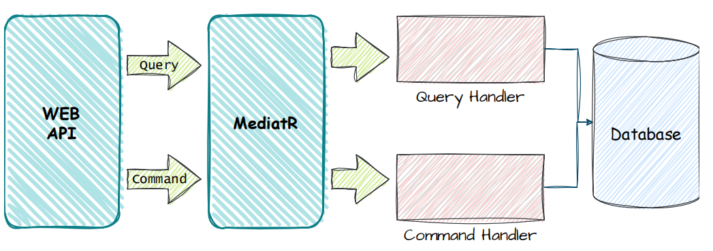

# BCA Code Challenge

Evandro Carneiro de Jesus

---

## Solution design

> Architecture

* .Net 8
* ASP.NET 8
* DDD-oriented microservice Architecture

I've opted to use a simple structure regarding the project's architecture, creating a 3-layer solution that focuses on the Business Logic for the requirements, concentrating on the Domain implementation. The structure is detailed on the next topic.

A brief explanation about each layer is mentioned on the image below:


[reference doc](https://learn.microsoft.com/en-us/dotnet/architecture/microservices/microservice-ddd-cqrs-patterns/ddd-oriented-microservice)

* CQS - Command-Query Separation

I used the CQS pattern, together with the MediatR framework, for handling the requests to the Domain.
This pattern enables a better separation between the flows for writing and reading data, providing the single responsibility for each request, facilitating its maintenance. Example representation:



* API

I decided to create an API for this code challenge, thus, not having created a UI. However, the project uses the Swagger framework, which can be used for the system management.

> Dependencies

* SqlServer Database
* Docker support (optional)
* docker-compose support (optional)

## Solution structure

* Api
    * Controllers ✓
    * Swagger ✓
    * Result as IActionResult ✓
* Domain
    * FluentValidations ✓
    * FluentResults ✓
    * Mediator ✓
* Infrastructure
    * Persistence
        * Dapper ✓
        * SQL ✓
	* MediatR pipelines ✓
* Tests
	* xUnit ✓
	* AutoFixture ✓
	* NSubstitute ✓
	* FluentAssertions ✓

## How-To's

### Run

* Using Docker

The solution is prepared to take advantage of containerization using docker containers and images.
If the user has the Docker installed, it can be used an SqlServer container to resolve the database dependency.

* With docker-compose ✓

I have created a docker-compose file for helping the containers creation, including a container for the project.
Therefore, assuming the docker-compose plugin is installed, run the following command on the repository source folder:

```
> docker-compose up -d
```

This will create the Project and the SqlServer containers, also creating the database and executing the scripts defined in `./Deploy/SQLScripts/`

The Application is running the the port 12000. So it's possible to access it from:

http://localhost:12000/api

### Endpoints usage

I have created the following 3 controllers:

* Vehicles

The vehicles can be added to the system independently, informing specific details depending on the vehicle type. The payload will be validated properly.

Ex:

```
POST /api/v1/vehicles
{
  "type": "Hatchback",
  "externalId": "6aa1eb6e-6cca-4599-9856-eea68586e73b",
  "manufacturer": "Renault",
  "model": "Clio",
  "year": 2020,
  "startingBid": 15000,
  "numberOfDoors": 4
}
```
<br />

* Users

A registered user is required in order to participate in the auctions and to place bids.

Ex:

```
POST /api/v1/users
{
  "name": "User Name"
}
```
<br />

* Auction

When creating an auction, only a vehicle Id should be informed:

```
POST /api/v1/auctions
{
  "vehicleId": "3fa85f64-5717-4562-b3fc-2c963f66afa6"
}
```

Then it's possible to start/close the auction:

```
PUT /api/v1/auctions/{id}/start
```

```
PUT /api/v1/auctions/{id}/close
```

Placing Bids for a specific Auction:

```
POST /api/v1/auction/{auctionId}/bids
{
  "amount": 1000,
  "userId": "3fa85f64-5717-4562-b3fc-2c963f66afa6"
}
```
<br />

:information_source: - All POST endpoints will return a location with the created resource Id, in case of success.
Also, there is a respective GET by Id endpoint to get the resource with the returned Id.

---